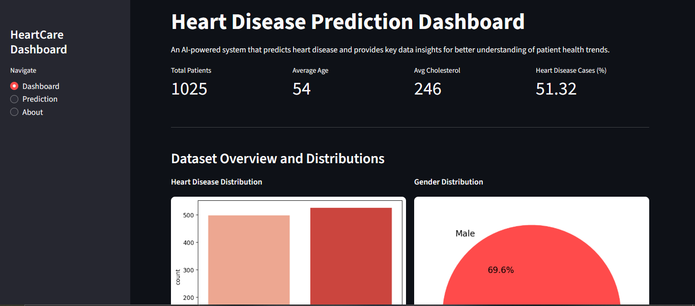
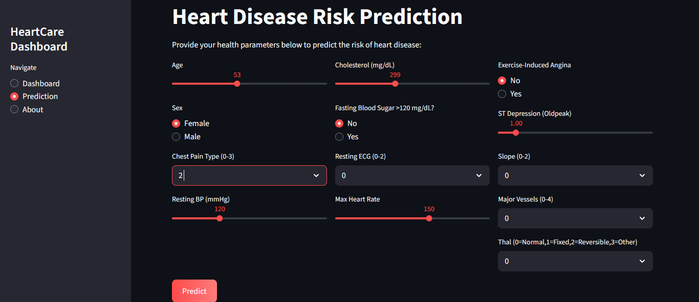
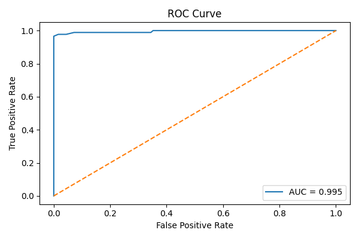

# ❤️ Heart Disease Prediction and Visualization Dashboard

[](https://heart-disease-prediction-shreyanipunge.streamlit.app)


---

### 🚀 Overview
This project is a **machine learning-powered web application** for predicting heart disease risk using patient health data.  
It integrates **data analysis, model training, and visualization** into a unified **Streamlit dashboard**, enabling users to input medical details and instantly receive predictions along with actionable insights.

---

## 🎯 Objective
- Analyze a dataset containing **1,025 patient records** and **14 clinical features**.  
- Train multiple ML models to predict heart disease and select the most accurate one.  
- Provide a web-based interface for real-time prediction and visualization.  
- Offer health recommendations based on the prediction results.

---

## 🧠 System Workflow
1. **Data Loading and Cleaning** – Load `heart.csv`, handle missing values, and standardize columns.  
2. **Visualization and Insights** – Display gender, target distributions, and correlations between features.  
3. **Model Development** – Train Logistic Regression, Random Forest, and XGBoost models using pipelines.  
4. **Evaluation** – Compare models using accuracy and ROC-AUC; select best model (Random Forest, 98.1%).  
5. **Deployment** – Save the trained model as `heart_model.pkl` and serve predictions via Streamlit app.

---

## 🧩 Tech Stack

| Category | Tools / Libraries |
|-----------|-------------------|
| Language | Python |
| Data Handling | pandas, numpy |
| ML Models | scikit-learn, XGBoost |
| Visualization | matplotlib, seaborn |
| Model Persistence | joblib |
| Web Framework | Streamlit, streamlit-lottie |
| IDE / Platform | VS Code, Google Colab |

---

## 🩺 Dataset Description

- **Records:** 1,025  
- **Features:** 13 inputs + 1 target  
- **Target:** `1` → Heart Disease, `0` → Healthy  

| Feature | Description |
|----------|--------------|
| age | Age of patient |
| sex | Gender (1 = Male, 0 = Female) |
| cp | Chest Pain Type (0–3) |
| trestbps | Resting Blood Pressure |
| chol | Serum Cholesterol (mg/dL) |
| fbs | Fasting Blood Sugar >120 mg/dL |
| restecg | Resting ECG Results (0–2) |
| thalach | Maximum Heart Rate Achieved |
| exang | Exercise-Induced Angina (1/0) |
| oldpeak | ST Depression (Oldpeak) |
| slope | Slope of ST Segment |
| ca | Number of Major Vessels (0–4) |
| thal | Thalassemia (0=Normal,1=Fixed,2=Reversible,3=Other) |

---

## ⚙️ Project Structure
```

fds_mini/
├── app.py                         # Streamlit dashboard
├── heart.csv                      # Dataset
├── heartdiseaseprediction_model.py # ML training script
├── requirements.txt                # Project dependencies
├── roc_curve.png                   # ROC curve plot
├── .gitignore
└── README.md

````

---

## 💻 How to Run Locally

### 1️⃣ Clone the repository
```bash
git clone https://github.com/Shreya-nipunge/Heart-Disease-Prediction-Dashboard.git
cd Heart-Disease-Prediction-Dashboard
````

### 2️⃣ Create and activate a virtual environment

```bash
python -m venv venv
# Windows
venv\Scripts\activate
# macOS/Linux
source venv/bin/activate
```

### 3️⃣ Install dependencies

```bash
pip install -r requirements.txt
```

### 4️⃣ Train the model (optional)

```bash
python heartdiseaseprediction_model.py
```

### 5️⃣ Run the web app

```bash
streamlit run app.py
```

---

## 📊 Results

* **Best Model:** Random Forest Classifier
* **Test Accuracy:** 98.1%
* **Top Features:** Age, Cholesterol, Chest Pain Type, Max Heart Rate, Resting BP
* **Evaluation Metrics:**

  * Precision: 0.98
  * Recall: 0.98
  * F1-score: 0.98

---

## 🩷 Dashboard Features

### 🖼️ *Dashboard Overview*



### 🖼️ *Prediction Form*



### 🖼️ *ROC Curve*



---

## 🧭 Insights & Recommendations

* Maintain **cholesterol < 200 mg/dL** and exercise regularly.
* Monitor **blood pressure** and reduce salt intake.
* Avoid **smoking** and manage **stress** effectively.
* Regular **cardiology check-ups** are essential for high-risk patients.

---

## 🧪 Future Enhancements

* Add new features (BMI, Smoking, ECG signals).
* Integrate Deep Learning or AutoML for improved performance.
* Deploy to **Streamlit Cloud**, **Render**, or **Hugging Face Spaces**.
* Make UI mobile-responsive and visually interactive.

---

## 👩‍💻 Author

**Shreya Pravin Nipunge**
B.E. Artificial Intelligence and Data Science
[Vivekanand Education Society's Institute of Technology (VESIT)](https://vesit.ves.ac.in)

---

## 📜 License

This project is licensed under the **MIT License**.
Feel free to use, modify, and share for learning and research purposes.

---

### 🛠️ Made With

💻 Python | ⚙️ Scikit-learn | 🌿 XGBoost | 🎨 Streamlit | 📊 Seaborn | ❤️ Passion for AI & Data Science
